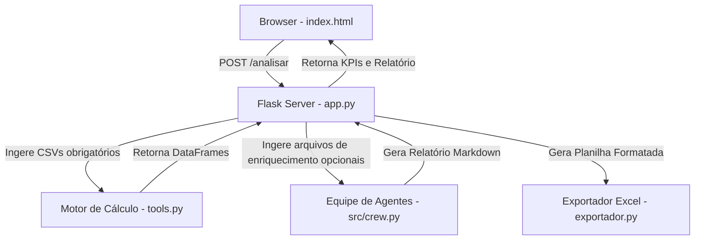

# Design Spec: Custo Certo AI - Web Interface Local

Este documento especifica o design da interface web local do **Custo Certo AI**, permitindo a execução de análises de controladoria industrial via navegador de forma desktop-friendly, responsiva e com suporte a arquivos opcionais de enriquecimento de dados.

---

## 1. Visão Geral e Requisitos

### Objetivos
- **Desktop Friendly:** Permitir operação local simplificada através do navegador.
- **Upload de Arquivos:** Suporte a arquivos obrigatórios (`custos_financeiros.csv` e `logs_operacionais.csv`) e arquivos opcionais (BOM, Budget, Notas do Chão de Fábrica).
- **Responsividade:** Layout responsivo puro usando TailwindCSS v4.
- **Visualização & Download:** Visualização rápida de KPIs, parecer executivo gerado pelos agentes e botões para baixar os resultados (Excel e HTML).

---

## 2. Arquitetura do Sistema

O ecossistema é dividido em duas partes:

### 2.1 Backend (Flask - `app.py`)
O servidor Flask escutará em `http://localhost:5000` (ou porta dinâmica configurada) e fornecerá os seguintes endpoints:
1. `GET /` : Renderiza `index.html`.
2. `POST /analisar` : Processa uploads, executa o motor matemático e inicia a orquestração dos agentes (Crew AI) com as informações básicas e enriquecidas.
3. `GET /download/excel` : Retorna a planilha `.xlsx` gerada.
4. `GET /download/html` : Retorna o relatório `.html` gerado.

### 2.2 Frontend (HTML + TailwindCSS v4)
Um arquivo único `templates/index.html` contendo:
- Importação do TailwindCSS v4 via CDN.
- Layout responsivo de 2 colunas para telas grandes e 1 coluna empilhada para telas pequenas.
- Tratamento de upload de arquivos com drag-and-drop.
- Exibição dinâmica de progresso e resultados pós-análise.
- Suporte a tema escuro/claro nativo do Tailwind.

---

## 3. Fluxo de Integração de Dados Opcionais

Para enriquecer a análise, o usuário poderá fazer o upload de até 3 arquivos opcionais adicionais:
1. **Ficha Técnica / BOM (Bill of Materials):** Tabela de insumos e tempos de processo.
2. **Orçamento / Metas (Budget):** Comparação orçado vs. realizado.
3. **Observações de Chão de Fábrica:** PDFs ou arquivos de texto livre.

No backend:
- Se presentes, os arquivos CSV/Excel (BOM/Budget) serão parseados para strings no formato Markdown usando Pandas.
- Os arquivos textuais/PDFs serão lidos como texto bruto.
- Esses conteúdos serão injetados como contexto adicional no prompt do **Auditor de Processos** e do **Diretor de Controladoria (CFO)**, permitindo pareceres muito mais detalhados e integrados com a realidade da operação.

---

## 4. Plano de Testes e Validação
1. **Testes Unitários:** Validar se a rota `/analisar` processa corretamente os arquivos opcionais.
2. **Testes de Integração:** Verificar se a planilha e relatórios são salvos corretamente na raiz ao final da execução web.
3. **Validação UI/UX:** Testar a responsividade e a ausência de quebras de layout (overflows) em diferentes resoluções.
